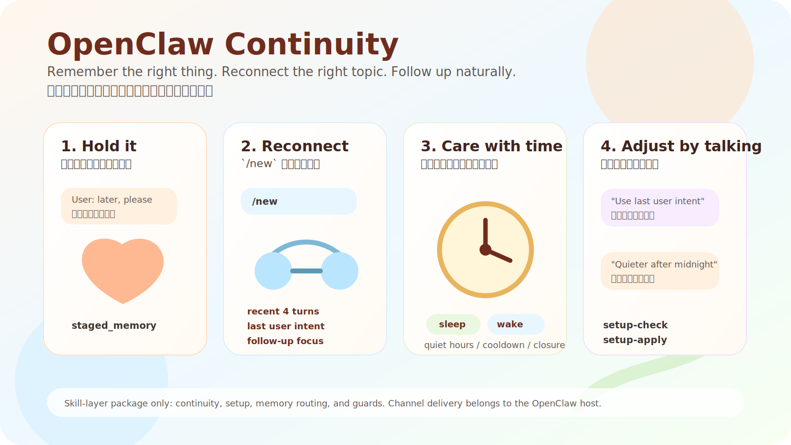
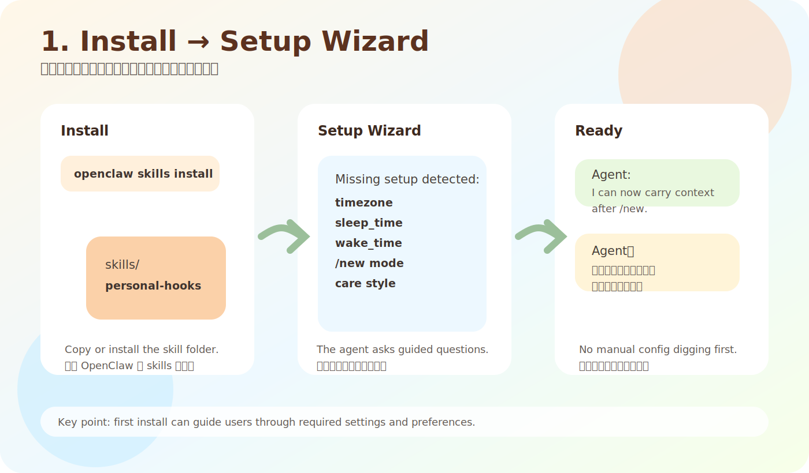
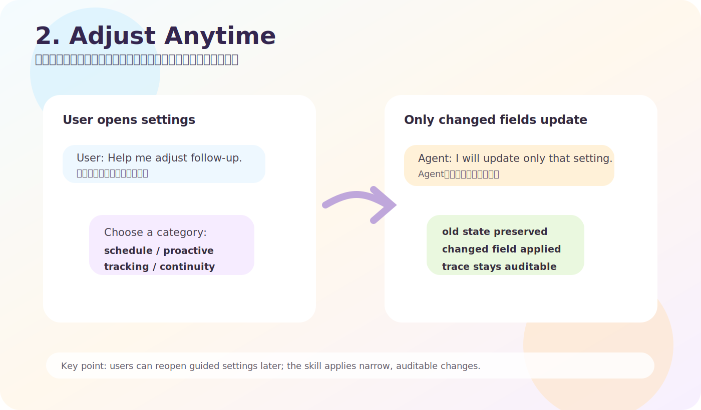
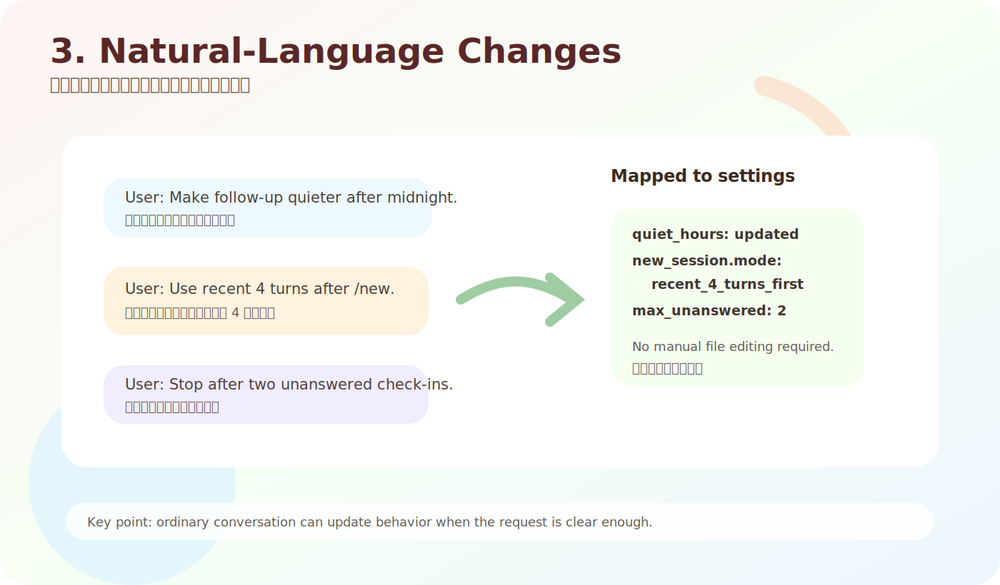
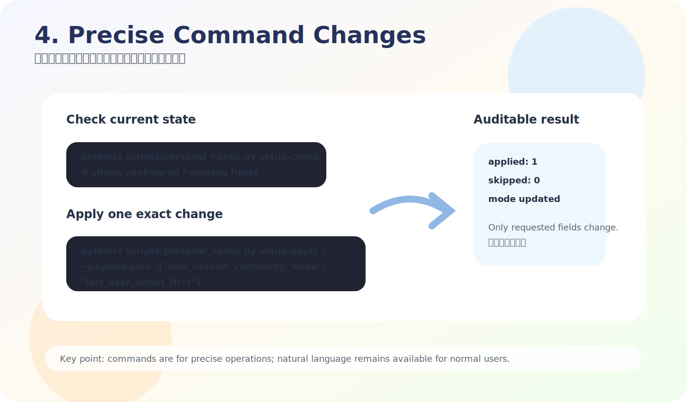

# OpenClaw Continuity

Make OpenClaw remember the right thing, reconnect the right topic after `/new`,
and follow up naturally without leaking internal state into chat.

`OpenClaw Continuity` is the public product name for the `personal-hooks` skill
package. It is a **skill-layer continuity engine** for an existing OpenClaw
agent: it does not replace the agent's persona, and it does not bundle a
chat-platform adapter.



## Four Quick Comics

These four panels show the parts that matter most after someone installs the
skill: guided setup, later adjustment, natural-language setting changes, and
precise command changes.









## For Everyone

Most agents can answer a message. The harder part is remembering what still
matters after an interruption, a delayed reply, or a new conversation.

OpenClaw Continuity helps an agent:

- keep ordinary chat light
- stage "let's talk about this later" without losing it
- track important follow-up without chasing every casual sentence
- reconnect the right topic after `/new`
- understand time with sleep/wake and routine context
- let the user adjust behavior in natural language

中文簡介：

OpenClaw Continuity 是替 OpenClaw 補上「延續感、時間感、關心與追蹤」的技能包。
它不是單純排程發訊息，也不是把所有對話都硬塞進記憶。它會分辨哪些只是一般聊天，
哪些要暫存，哪些真的需要追蹤，並在新開對話時接回使用者選定的承接方式。

## What It Feels Like

Example:

```text
User: I need to pause this repo release check. Let's continue later.
Agent: Got it. I will keep the release check as the thread to continue.

/new

Agent: I still have the release check thread. Do you want to pick it up from
the last user intent, the follow-up focus, or the recent conversation summary?
```

中文例子：

```text
使用者：這個技能上架檢查先放著，晚點再接。
Agent：好，我先把這段接住，不會當成一般閒聊丟掉。

/new

Agent：前面那段技能上架檢查我還接得住。現在要從最後意圖、追蹤焦點，
還是最近 4 輪摘要開始？
```

The exact wording still belongs to the host agent's persona. This skill supplies
the structured continuity state that makes the answer possible.

## Minimal Telegram/TG Showcase

Telegram/TG can be used as a small live showcase **when your OpenClaw host is
already connected to Telegram**. The skill does not bundle a Telegram adapter or
bot setup; it only supplies the continuity behavior that the host sends through
its normal reply pipeline.

Demo flow:

```text
TG user: 這個上架檢查先放著，晚點再接。
Agent: 好，我先幫你接住這條線，不會當成普通閒聊丟掉。

TG user: /new
Agent: 前面那個上架檢查我還接得住。要從最近 4 輪、最後意圖，還是追蹤焦點接？

TG user: 新對話改成看最後使用者意圖。
Agent: 已更新。之後新對話會優先從最後使用者意圖承接。
```

What this demonstrates:

- `/new` carryover
- staged memory instead of forced tracking
- natural-language settings update
- frontstage text stays user-facing, not internal runtime text

## Core Features

- **New conversation carryover**
  `/new` can reconnect the right previous thread instead of starting from a blank greeting.

- **User-selectable `/new` continuity mode**
  The user can choose which anchor should lead a new conversation:
  `recent_4_turns_first`, `last_user_intent_first`, `followup_focus_first`,
  `assistant_commitment_first`, or `balanced`.

- **Ordinary chat / staged memory / tracked follow-up**
  The runtime separates casual chat from staged memory and formally tracked events.

- **Four tracked event types**
  `parked_topic`, `watchful_state`, `delegated_task`, and `sensitive_event`.

- **Structured event chain**
  Keeps `context_before`, `event_core`, `immediate_result`, and
  `followup_focus` inspectable.

- **Assistant commitment tracking**
  If the assistant promised to check, remember, or come back to something, that
  commitment can become part of the continuity state.

- **Time-aware wording**
  Uses elapsed time, day boundary, sleep/wake boundary, and routine phase as
  support. Time context does not replace the selected main thread.

- **Care and follow-up controls**
  Closure, cooldown, dedupe, dispatch cap, quiet hours, and sleep/rest suppress
  are explicit settings instead of hidden model guesses.

- **Daily-memory writeback**
  Staged and tracked items write concise traces from structured continuity
  state, not from improvised frontstage text.

- **Guided setup**
  First install can ask for timezone, sleep/wake time, relationship/use case,
  `/new` continuity mode, and voice/image continuity preference.

- **Natural-language settings**
  Users can say things like "make follow-up quieter after midnight" or
  "新對話改成看最後使用者意圖" and the skill maps that to settings.

## What Is In Scope

This package defines the skill behavior:

- state-backed continuity
- `/new` reattachment
- staging and tracked follow-up
- routine/time context
- setup wizard and settings updates
- frontstage safety guards at the skill/tool layer
- release harness and acceptance checks

## What Is Not In Scope

This package does not claim a list of external chat platforms. Channel delivery
belongs to the OpenClaw host and its adapter configuration.

That boundary is intentional: the same skill can run through the ordinary
OpenClaw reply pipeline without becoming tied to one chat surface.

## Setup Wizard

First install can enter guided setup when required fields or first-run preference
fields are missing.


The setup flow covers:

- `timezone`
- `sleep_time`
- `wake_time`
- `relationship`
- `use_case`
- `new_session_continuity_mode`
- `modality_continuity_mode`

The two newest user-facing choices are:

```json
{
  "new_session_continuity": {
    "mode": "recent_4_turns_first"
  },
  "modality_continuity": {
    "enabled": true,
    "mode": "preserve_when_supported",
    "voice_reply_on_voice_thread": true,
    "image_context_carryover": true
  }
}
```

`modality_continuity` is host-neutral. It only expresses a preference. It does
not add a voice engine, image model, or channel adapter to this skill package.

## Change Settings Later


Natural language:


```text
Help me adjust my follow-up settings.
Make follow-up quieter after midnight.
Use the last user intent when a new conversation starts.
新對話承接改成最近 4 輪摘要。
把主動關心改保守一點。
半夜不要主動追蹤我。
```

Command-style:


```bash
python3 scripts/personal_hooks.py setup-check
python3 scripts/personal_hooks.py setup-apply --payload-json '{"new_session_continuity_mode":"last_user_intent_first"}'
python3 scripts/personal_hooks.py setup-apply --payload-json '{"modality_continuity_mode":"preserve_when_supported"}'
python3 scripts/personal_hooks.py setup-apply --payload-json '{"sleep_time":"23:00","wake_time":"07:00"}'
```

Supported `/new` continuity modes:

| Mode | What leads the next conversation |
| --- | --- |
| `recent_4_turns_first` | Compact recent 4-turn summary |
| `last_user_intent_first` | Last user-side intent from compact anchor turns |
| `followup_focus_first` | `event_chain.followup_focus` |
| `assistant_commitment_first` | Prior assistant promise/commitment |
| `balanced` | Runtime chooses the best anchor for the user's opening message |

## Install

Copy or symlink this folder into an OpenClaw workspace:

```text
openclaw-workspace/
  skills/
    personal-hooks/
      SKILL.md
      scripts/
      docs/
      examples/
```

Install the Python dependency:

```bash
python3 -m pip install -r requirements.txt
```

Initialize:

```bash
python3 /path/to/openclaw-workspace/skills/personal-hooks/scripts/personal_hooks.py init
```

Optional installer:

```bash
bash scripts/install_local.sh /path/to/openclaw-workspace/skills link
```

ClawHub-style install:

```bash
openclaw skills install openclaw-continuity
```

npm-style fetch from GitHub:

```bash
npm install github:redwakame/openclaw-continuity#v2.0.21
```

## Install Review Notes

This package uses an instruction-first install path. There is no opaque remote
installer in the registry entry; the visible steps are the OpenClaw skill
install command, the Python dependency install, and the optional local helper
script.

Runtime requirements are intentionally small:

- `python3`
- `OPENCLAW_STATE_DIR`
- `OPENCLAW_CONFIG_PATH`
- Python dependency: `send2trash`

The skill contains executable Python runtime scripts, including the main
`scripts/personal_hooks.py` runtime. Before running it against a sensitive or
production agent, review the scripts you plan to execute, especially:

- `scripts/personal_hooks.py`
- `scripts/followup_skill_harness.py`
- `scripts/install_local.sh`

Suggested checks:

- confirm there are no unexpected network calls or hardcoded remote endpoints
- confirm only the declared state/config paths are needed for normal runtime
- use an isolated `OPENCLAW_STATE_DIR` for first-run testing
- avoid pointing `OPENCLAW_CONFIG_PATH` at a production config containing
  provider keys until you have reviewed the code

This is a state-backed continuity skill. Reading and writing a dedicated
OpenClaw state directory is expected behavior; reading unrelated host secrets or
sending user data to external services is not part of this package's design.

## Verify

Run the regression harness:

```bash
python3 /path/to/openclaw-workspace/skills/personal-hooks/scripts/followup_skill_harness.py --absence-minutes 3
```

Expected result:

```json
{
  "summary": {
    "pass_count": 14,
    "fail_count": 0
  }
}
```

Quick manual behavior check:

1. Ask the agent to hold a topic for later.
2. Start `/new`.
3. Confirm it reconnects the selected continuity anchor instead of generic small talk.
4. Ask to change setup, for example: `新對話改成看最後使用者意圖`.

## Technical Map

Important files:

- `SKILL.md`: trigger rules and runtime boundary
- `scripts/personal_hooks.py`: main runtime
- `scripts/followup_skill_harness.py`: regression harness
- `config.schema.json`: settings schema
- `examples/settings.sample.json`: sample settings
- `docs/install.md`: installation details
- `docs/host-operator-settings.md`: operator settings
- `docs/release-acceptance.md`: release gate
- `docs/publish-copy.md`: GitHub / ClawHub copy source

Main runtime surfaces:

- `build_runtime_context()`: builds carryover, schedule, setup, and guard prompts
- `intercept_message()`: routes the user turn into casual/staged/tracked state
- `process_candidate_buffer()`: promotes candidate state to incidents/hooks
- `setup-check` / `setup-apply`: guided configuration commands
- `frontstage-guard`: skill/tool-layer output safety guard

## Public V2 Includes

- `casual_chat / staged_memory / tracked_followup` routing
- `parked_topic`
- `watchful_state`
- `delegated_task`
- `sensitive_event`
- `candidate -> incident -> hook` promotion
- structured `event_chain`
- structured `causal_memory`
- `/new` carryover
- user-selectable `/new` continuity mode
- assistant commitment support
- routine/time context as support-only signal
- quiet hours
- sleep/rest suppress
- cooldown
- closure
- dedupe
- dispatch cap
- daily-memory writeback
- deterministic onboarding
- guided settings
- natural-language settings changes
- host-neutral modality preference
- regression harness

## 中文功能總覽

- 一般聊天、暫存記憶、正式追蹤分流
- `/new` 後接回正確主題
- 可選新對話承接方式：最近 4 輪、最後使用者意圖、因果跟進焦點、助手承諾、綜合判斷
- 作息與時間感只當輔助，不搶主線
- 可用自然語言調整設定
- 可用指令精準修改設定
- 關心與追蹤有冷卻、退場、去重、上限與勿擾
- 暫存/追蹤內容可寫回 daily memory trace
- 技能層保持平台中立，不把通訊渠道寫死進技能定義

## Contact

If you are interested in this package, run into a problem, or want to exchange
ideas about OpenClaw continuity, feel free to contact me:

- `adarobot666@gmail.com`

If you are satisfied with this skill package, please star the GitHub repository
as encouragement. I will keep pushing improvements, maintenance, and new
features.

如果你對這個技能包有興趣、使用時遇到問題，或想交流 OpenClaw continuity
相關想法，歡迎聯繫我：

- `adarobot666@gmail.com`

如果你滿意這個技能包，也歡迎在 GitHub 給一顆星作為鼓勵。我會持續推動
優化、維護與新功能追加。
