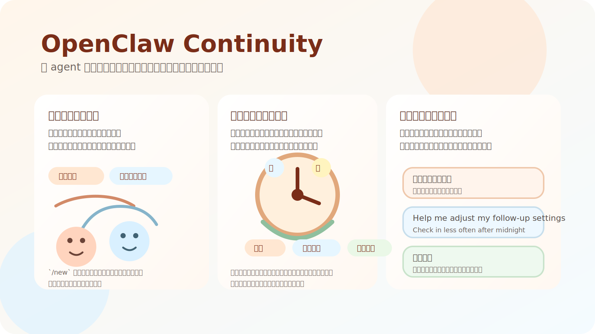
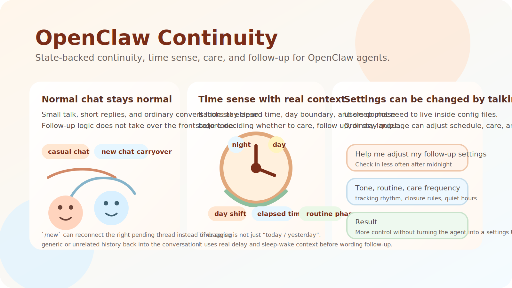
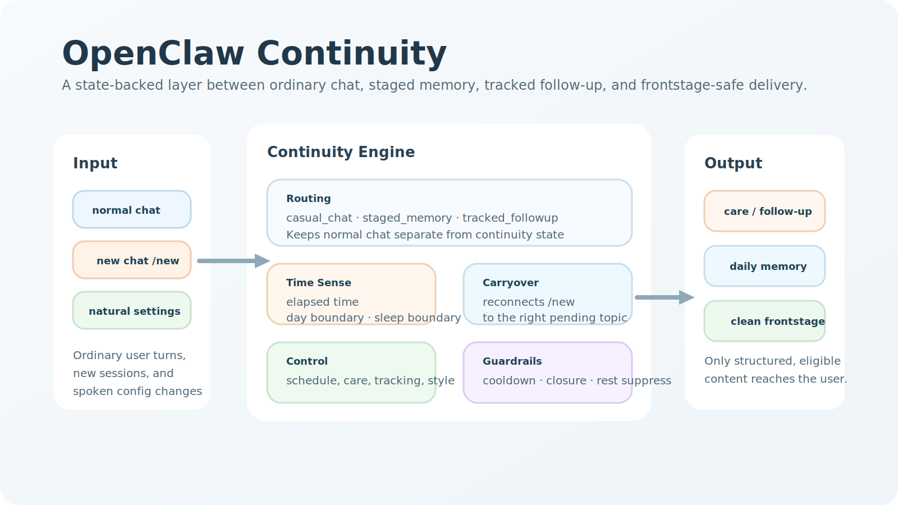

# OpenClaw Continuity

`OpenClaw Continuity` is the public product name for the `personal-hooks`
skill package.

It is built for a simple outcome:

- remember the right thing
- reconnect the right topic after `/new`
- follow up naturally without leaking internal continuity logic into frontstage chat

It adds a **state-backed continuity engine** to OpenClaw agents so they can:

- keep `/new` carryover attached to the right topic
- distinguish ordinary chat, staged memory, and tracked follow-up
- understand time using elapsed time, cross-midnight context, and routine phase
- let users adjust care and follow-up behavior with natural language instead of rigid config editing
- let users directly ask to change behavior, pacing, or settings without hunting for backend commands

## One-line summary

Make OpenClaw remember the right thing, reconnect the right topic after `/new`,
and follow up naturally.







## 中文簡介

`OpenClaw Continuity` 是一個替 OpenClaw 補上「延續感、關心、追蹤」
的技能包。它不改掉 agent 的人格，也不是再堆一層 prompt，而是補上一個
穩定、可檢查、可驗證的 continuity engine，讓日常對話、暫存話題、
正式追蹤與主動關心能分得開，又能在需要時自然接回。

使用者最直接感受到的是：

- **`/new` 之後能接回正確主題**
  - 不會一重開對話就掉回空泛寒暄
- **「晚點再聊」真的能被暫存**
  - 暫存話題、正式追蹤、一般聊天分得開
- **關心與追蹤不亂追、不亂漏**
  - 有 closure、cooldown、dedupe、dispatch cap、作息抑制
- **設定可以直接用口語調**
  - 不用每次都去翻設定檔
- **功能和節奏可以直接開口改**
  - 像是「幫我調整關心設定」、「把主動關心改保守一點」、「半夜不要一直追」、「追蹤晚一點再提醒我」

它補的是現在很多 agent 最常缺的四件事：

- **時間感不只靠報時或跨日猜測**
  - 看經過多久、是否跨日、是否跨睡眠/醒來邊界、現在在哪個作息階段
- **新開對話仍有延續感**
  - `/new` 之後能接回前一段真正重要的話題，不亂拉舊上下文
- **改設定不用進後台硬改檔**
  - 能用自然口語調整作息、主動關心、追蹤節奏與互動風格
- **關心與追蹤不破壞正常聊天**
  - 關心、追蹤、冷卻、退場、記憶寫回都有結構依據，不靠模型亂猜

## English overview

`OpenClaw Continuity` adds a stable middle layer between ordinary chat,
staged topics, tracked follow-up, and proactive care. It is designed for
agents that need continuity without letting internal memory logic leak into
frontstage conversation.

What users notice first:

- `/new` reconnects the right pending topic instead of collapsing into generic small talk
- “let's talk about it later” can stay staged instead of being forgotten
- follow-up stays explicit with closure, cooldown, dedupe, dispatch caps, and sleep/rest suppress
- settings can be changed through ordinary language instead of config-only control
- behavior can be adjusted directly in chat instead of forcing users into backend-only commands

What the package provides under the hood:

- keep `/new` continuity attached to the correct topic
- keep staged and tracked follow-up explicit and inspectable
- keep time sense grounded in elapsed time, day boundary, and routine phase
- keep memory writeback grounded in structured state, not model improvisation
- let users change follow-up behavior through ordinary language, not only config files

## Core value / 核心價值

- **Detailed time sense / 時間感不是模糊猜測**
  - evaluate elapsed time, cross-midnight context, sleep/wake boundary, and routine phase before wording care or follow-up
- **Continuity that survives a new chat / 新開對話仍能接回**
  - keep `/new` carryover attached to the right pending topic instead of collapsing into generic small talk
- **Natural-language control / 口語就能改設定**
  - adjust schedule, proactive care, tracking rhythm, and style through ordinary requests
- **Direct in-chat changes / 功能與指令不用卡在後台**
  - ask for more or less follow-up, quieter nights, slower retries, or different care style directly in chat
- **Frontstage-safe care and follow-up / 關心與追蹤不把對話帶歪**
  - cooldown, closure, sleep/rest suppress, and dispatch caps stay explicit
- **Structured writeback / 記憶寫回有依據**
  - staged and tracked items write concise daily-memory traces with causal context
- **Host-neutral release package / 發佈包可攜**
  - GitHub / ZIP / ClawHub / npm-friendly layout with optional host glue

## Who this is for / 適合誰

- OpenClaw operators who want state-backed continuity instead of prompt-only memory
- builders who need `/new` carryover, closure, cooldown, and dispatch caps
- companion-style or task-follow-up agents that must keep normal chat clean
- teams who need a continuity layer that can be explained to both end users and technical reviewers

## Contact / 聯絡交流

Questions, feedback, and implementation discussion:

- `adarobot666@gmail.com`

If this package helps and you want to keep improvements and maintenance moving,
please star the repository on GitHub.

如果這個技能對你有幫助，而且你也期待它持續優化與維護，歡迎在 GitHub
給一顆星，這會是最直接的支持。

## What makes it different

- **Time sense that is actually usable**
  - not just “today / yesterday”
  - evaluates how long ago something happened and whether it crossed a sleep boundary
- **Carryover that works across chat sessions**
  - `/new` can reconnect the real pending thread without dragging unrelated history back in
- **Settings you can change by talking**
  - examples:
    - `幫我調整關心設定`
    - `把主動關心改成保守一點`
    - `半夜不要一直提醒我`
    - `追蹤改成晚一點再問`
    - `Help me adjust my follow-up settings`
    - `Check in less often after midnight`
    - `Be quieter tonight`
- **Memory that stays auditable**
  - staged and tracked items leave concise, structured traces instead of vague “the model probably remembered it”

## Quick verify

If you already have an OpenClaw workspace, the fastest sanity check is:

```bash
python3 /path/to/openclaw-workspace/skills/personal-hooks/scripts/personal_hooks.py init
python3 /path/to/openclaw-workspace/skills/personal-hooks/scripts/followup_skill_harness.py --absence-minutes 3
```

Expected result: the harness completes cleanly and the skill creates state
under the host workspace, not inside this package root.

Quick behavior check:

1. tell the agent to remember or track something for later
2. start `/new`
3. verify that it reconnects the right pending topic instead of resetting into generic chat

## Read this first

- Reviewer-oriented package status and file map:
  - [AUDIT.md](AUDIT.md)
- V2 status, validation evidence, and publication gate:
  - [docs/v2-status.md](docs/v2-status.md)
  - [docs/v2-validation-summary.md](docs/v2-validation-summary.md)
  - [docs/v2-known-limits.md](docs/v2-known-limits.md)
  - [docs/release-acceptance.md](docs/release-acceptance.md)
- Host/runtime boundary and outbound stopgap:
  - [docs/host-boundary.md](docs/host-boundary.md)
  - [docs/host-frontstage-stopgap.md](docs/host-frontstage-stopgap.md)
- Operator-facing knobs:
  - [docs/host-operator-settings.md](docs/host-operator-settings.md)

## Latest shared fixes now in the public package

These are now part of the A-bucket public package, not just lab-only patches:

- deterministic onboarding now strips the web UI timestamp prefix before parsing
- deterministic onboarding/writeback now covers:
  - `timezone`
  - `sleep_time`
  - `wake_time`
  - `relationship`
  - `use_case`
- generic `UTC/GMT` offsets now stay as generic fixed offsets (for example
  `UTC+08:00`) instead of being forced into a city timezone like
  `Asia/Taipei`
- deterministic guided-settings parsing now covers English natural requests such as:
  - `turned on / turned off`
  - `checking in every 2 hours`
  - `retrying after 30 minutes`
  - `stopping after 2 unanswered check-ins`
- guided-settings writeback now updates both:
  - `proactive_chat.*`
  - routine phase policy for `routine_schedule.phases.active_day`
- `/new` follow-up now includes a low-information guard so a bare `hi` right
  after `/new` is less likely to collapse into generic time-of-day chatter
- English frontstage sanitization no longer rewrites ordinary phrases like
  `sleep schedule` into mixed-language internal artifacts
- the optional bridge addon now injects:
  - `time_modifier_prompt`
  - post-`/new` low-information continuity guard
  so web hosts receive the same continuity/tone constraints as the skill path

For optional voice/TTS host integration, see
[docs/host-voice-integration.md](docs/host-voice-integration.md).

For an optional packaged host addon (bridge template + runtime patch guide),
see [addons/host-frontstage-stopgap/README.md](addons/host-frontstage-stopgap/README.md).

For an optional host-side voice/TTS addon template, see
[addons/host-voice-send-template/README.md](addons/host-voice-send-template/README.md).

It solves the gap between:

- ordinary chat that should stay light
- topics that should be staged for later
- events that should become formally tracked

The shipped scope is deliberately narrow: it is a V2 continuity/follow-up
skill, not a full autonomy package and not an always-on idle/social nudging
package.

## Public V2 includes

- `casual_chat / staged_memory / tracked_followup` routing
- four event types:
  - `parked_topic`
  - `watchful_state`
  - `delegated_task`
  - `sensitive_event`
- incremental `event_chain` updates
- `candidate -> incident -> hook` flow
- `/new` carryover
- active hook / closure lifecycle
- sleep/rest suppress
- dedupe / cooldown / dispatch cap
- frontstage guard
- structured trace
- regression harness
- live QA runbook

## Public V2 does not include

- always-on idle/social nudging as a default capability
- user-configured idle chat frequency
- proactive chatting with no tracked continuity source
- host transport/network reliability fixes

## Package layout

- `SKILL.md`: trigger rules and runtime boundary
- `scripts/`: runtime script and verification helpers
- `docs/`: call flow, harness usage, live QA, V2 blueprint
- `examples/`: sample config and sample report
- `config.schema.json`: public config schema
- `LICENSE`: package license

## Quick install

This package is designed for users who already have an OpenClaw environment.

It is close to drop-in for an existing OpenClaw workspace, but it is not a
fully standalone one-click app.

Recommended OpenClaw layout:

```text
openclaw-workspace/
  skills/
    personal-hooks/
```

## Install routes

### GitHub release ZIP

- Download the latest release archive from GitHub Releases.
- Extract it and copy `personal-hooks/` into your OpenClaw `skills/` directory.

### ClawHub

```bash
openclaw skills install openclaw-continuity
```

### npm-style install from GitHub

If you want a one-line package fetch through npm without waiting for a public npm
registry publish, install directly from the GitHub repository:

```bash
npm install github:redwakame/openclaw-continuity#v2.0.9
```

This fetches the release source through npm's GitHub transport path.

Copy install:

```bash
cp -R /path/to/personal-hooks /path/to/openclaw-workspace/skills/personal-hooks
```

Symlink install:

```bash
ln -s /path/to/personal-hooks /path/to/openclaw-workspace/skills/personal-hooks
```

Or use the bundled portable installer:

```bash
bash scripts/install_local.sh /path/to/openclaw-workspace/skills link
```

Install the required Python dependency for the core skill:

```bash
python3 -m pip install -r requirements.txt
```

The current V2 public package only ships `scripts/install_local.sh`.
If an operator keeps a larger workspace wrapper around this skill, keep that
wrapper outside the portable package instead of assuming a bundled root
installer.

Quick start:

```bash
python3 /path/to/openclaw-workspace/skills/personal-hooks/scripts/personal_hooks.py init
python3 /path/to/openclaw-workspace/skills/personal-hooks/scripts/personal_hooks.py capability-state-show
```

Minimal verification:

```bash
python3 /path/to/openclaw-workspace/skills/personal-hooks/scripts/followup_skill_harness.py --absence-minutes 3
```

Browser/local-gateway-first:

- the core skill works through the ordinary OpenClaw reply pipeline
- browser/local gateway usage is supported
- A specific chat platform is not required for the core skill package

## Distribution modes

This package is prepared for:

- GitHub repository / release ZIP
- direct ZIP download / manual install
- ClawHub-style skill packaging
- npm tarball packaging (`npm pack`)

Default distribution mode is:

- **skill only**
- no automatic host bridge install
- no automatic gateway runtime patch

If a host wants the outbound stopgap for `<final>` / weird heartbeat text, use
the optional addon under:

- `addons/host-frontstage-stopgap/`

If a host wants optional voice/TTS rendering and channel delivery templates,
use:

- `addons/host-voice-send-template/`

That addon is **opt-in**. Downloading the package does not apply it by
default.

## What the skill gives you vs what the host must wire

Installing the public skill gives you the shared continuity layer:

- staged/tracked follow-up logic
- `/new` carryover and continuity reattach
- structured memory / causal memory
- guided settings entry and setup flow
- frontstage guard at the skill/tool layer

Some host-facing capabilities are intentionally **not** auto-installed with the
portable skill package:

- **TG bridge / outbound last-defense**
  - the host-side bridge hook that intercepts outbound delivery and catches
    dirty final text before it reaches the channel adapter
- **gateway hook wiring**
  - the runtime integration that actually calls `preagent-sync`,
    `runtime-context`, and `frontstage-guard` at the right lifecycle points
- **voice send addon**
  - an optional host-side TTS/media delivery layer
- **live heartbeat host glue**
  - the gateway/host configuration that lets background heartbeat-triggered
    follow-up run safely and consistently

So the public package is close to drop-in as a **skill**, but a host that wants
full Telegram-style live delivery behavior still needs to wire the optional
host pieces.

`npm` is not the primary runtime path for this package, but the repository now
ships a minimal `package.json` so operators can distribute the same skill folder
as an npm tarball when that is more convenient for mirrors or internal package
registries. The portable unit is still the OpenClaw skill folder plus optional
host addon assets.

ClawHub-style distribution uses the same package contents plus the package
metadata in `_meta.json`.

## Setup contract

This public package now has two skill-level setup entry paths:

1. **First install / first conversation**
   - If `SKILL_ONBOARD.md` exists, the host should enter guided setup.
   - The skill also performs deterministic setup autofill from explicit user
     onboarding text for:
     - timezone
     - sleep_time
     - wake_time
     - relationship
     - use_case
   - These values are written into skill settings and `USER.md` without relying
     on model classification alone.

2. **Re-open settings later**
   - The skill supports both:
     - explicit command-style entries such as `/care setup` or `/care config`
     - natural-language entries such as `幫我調整關心設定` or
       `Help me adjust my follow-up settings`
   - When triggered, the runtime context emits a guided settings prompt instead
     of leaving the behavior to undocumented host heuristics.
   - For English natural-language settings requests, the shared skill now also
     parses and applies common follow-up knobs deterministically before the
     model turn, including:
     - proactive on/off
     - proactive interval
     - quiet hours
     - retry-after cadence
     - stop-after unanswered count

## Installation

Copy or symlink this folder into an OpenClaw workspace skill directory, then point runtime state env vars at a writable data directory.

Typical layout:

```text
workspace/
  skills/
    personal-hooks/
      SKILL.md
      scripts/
      docs/
```

Runtime script:

```bash
python3 /path/to/personal-hooks/scripts/personal_hooks.py init
```

Optional env overrides:

- `PERSONAL_HOOKS_DATA_DIR`
- `PERSONAL_HOOKS_MEMORY_DIR`
- `PERSONAL_HOOKS_SESSIONS_INDEX_PATH`
- `PERSONAL_HOOKS_JOBS_PATH`
- `PERSONAL_HOOKS_OPENCLAW_CONFIG_PATH`
- `PERSONAL_HOOKS_SETTINGS_PATH`
- `PERSONAL_HOOKS_EMBEDDER_ROOT`
- `PERSONAL_HOOKS_PRIMARY_SESSION_KEY`
- `PERSONAL_HOOKS_TARGET_TO`

## Browser / local gateway usage

The package is designed for OpenClaw’s ordinary reply pipeline.

- `build_runtime_context()` builds continuity context for web/browser and direct-message paths that share the same ordinary reply chain.
- `personal_hooks.py` owns staged/tracked state and hook lifecycle.
- `scripts/web_live_runner.mjs` is an optional near-live browser runner for local gateway testing. It is not a channel transport validator, and it requires `PERSONAL_HOOKS_OPENCLAW_ROOT` so the package never hard-binds to a live workspace.

See [docs/install.md](docs/install.md) for a browser/local-gateway-first installation walkthrough.

## Settings you will most likely change

The most common settings live in:

- `examples/settings.sample.json`
- `config.schema.json`

Minimum usable settings are already reflected in the sample:

- `followup.enabled`
- `sleep_rest_suppress.enabled`
- `sleep_rest_suppress.duration_hours`
- `carryover.enabled`
- `carryover.max_turns`
- `carryover.top_summary_only`
- `dispatch.cooldown_minutes`
- `dispatch.cap`
- `closure.auto_close_on_user_reply`

Important:

- `experimental.rhythm_nudge.enabled` defaults to `false`
- public V2 does not depend on rhythm/nudge
- you can keep the sample settings as-is for a minimal public install

## Optional routine schedule settings

The public V2 package also includes an optional `routine_schedule` block.

- `routine_schedule` is not required for the minimal public install
- when enabled, it provides a structured schedule source for `sleep`, `wake_window`, and `active_day`
- `wake seed` uses structured `wake_time` / `wake_window_minutes` first, then falls back to memory-derived wake clues only when structured settings are unavailable
- `proactive_chat` still respects higher-priority task/emotional hooks; the routine phase only gates whether proactive/wake-seed are allowed and which interval applies

For field-level details, see [docs/routine-schedule.md](docs/routine-schedule.md).

## V2 status

This repository is the V2 public mainline for `personal-hooks`.

- The public package identity is V2.
- Publication is gated by the release acceptance matrix in `docs/release-acceptance.md`.
- Residual work should be judged as release-gate failures or documentation gaps within the current V2 package.

For V2-specific status and validation, see:

- [docs/v2-status.md](docs/v2-status.md)
- [docs/v2-validation-summary.md](docs/v2-validation-summary.md)
- [docs/v2-known-limits.md](docs/v2-known-limits.md)
- [docs/release-acceptance.md](docs/release-acceptance.md)

## Language and timezone neutrality

The public package is designed to follow the user's current dialogue and stored
state, not a fixed host language or host city.

- host glue should not force English when locale is unset
- explicit IANA timezones such as `America/New_York` should pass through
- generic offsets such as `UTC+8` / `GMT+8` should stay generic fixed offsets
  like `UTC+08:00`
- explicit place references such as `Taipei` / `台北` may still resolve to a
  city timezone

Current first-party public coverage is:

- zh-TW
- zh-CN
- English

The skill also recognizes some guided-settings entry phrases in Japanese,
German, Italian, and Spanish, but the package does not claim full first-party
frontstage prose localization for every language. The release gate is that the
skill must stay useful and not become host-bound or mixed-language contaminated.

## Testing

Minimal reproducible verification:

```bash
python3 /path/to/personal-hooks/scripts/followup_skill_harness.py --absence-minutes 3
```

See [docs/harness.md](docs/harness.md) for sandbox override details and
[docs/release-acceptance.md](docs/release-acceptance.md) for the release gate.

## Known limits

- Channel polling/send reliability is out of scope for the public package.
- The public package does not ship always-on idle/social nudging as a default.
- Frontstage warmth/personality still depends on the host agent’s own soul/persona/model.
- Carryover is intentionally short; it is not full transcript replay.

## Future install path

This repository may later grow toward a ClawHub/install-flow friendly package shape, but the current release is intentionally optimized for manual local installation in an existing OpenClaw environment.
